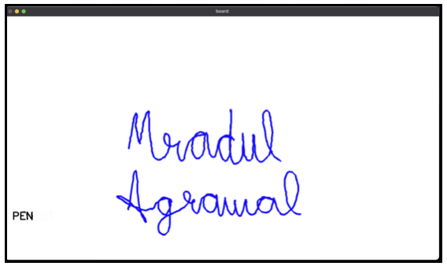
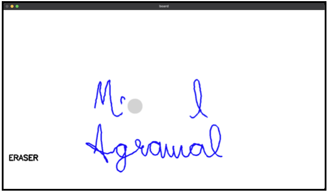

# Motion Based WhiteBoard

Tracks the movement of user using Webcam and performs various operations such as writing, deletion and clearing the screen.

## Requirments

```bash
pip install opencv-python
pip install numpy
```

## Installation

```bash
git clone https://github.com/mradul2/motion-based-whiteboard
```

## Usage

```bash
python3 main.py
```

- The two modes (Pen and Eraser) are switched when Pen is taken away from the screen.
- Board is refreshed when the Pen is taken close to Webcam.

## Output

### Sample outputs in pen and eraser mode

#### Pen Mode



#### Eraser Mode



## About
